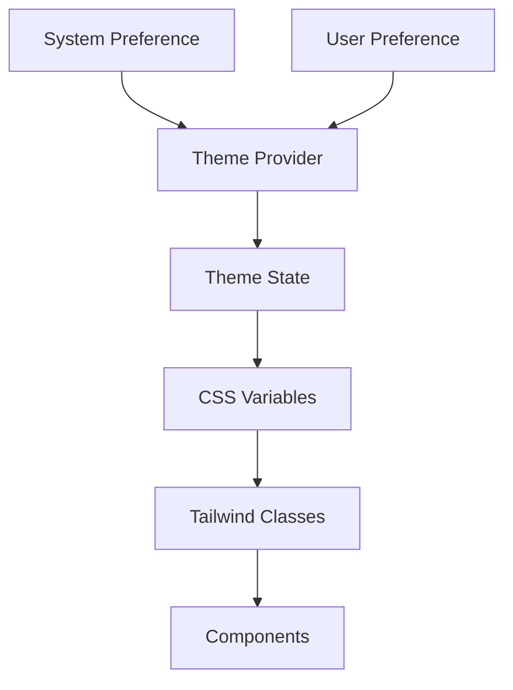

# ProFlow Architecture Overview

## Technology Stack

### Frontend
- **Framework**: Next.js 14 (App Router)
- **UI Library**: React
- **Styling**: Tailwind CSS
- **State Management**: React Context + Server Components
- **Theme Management**: next-themes

### Backend
- **Runtime**: Node.js
- **API**: Next.js API Routes
- **Authentication**: NextAuth.js
- **Database ORM**: Prisma
- **Database**: SQLite (Development)

## Core Components

### Authentication System
- JWT-based authentication using NextAuth.js
- Protected routes and API endpoints
- Session management
- User roles and permissions

### Project Management
- Project CRUD operations
- Team collaboration features
- Task management system
- Real-time updates (planned)

### User Interface
- Responsive design
- Dark/Light theme support
- Component-based architecture
- Accessible UI elements

### Theme System

The theme system is built on three main pillars:

1. **Theme Provider (`next-themes`)**
   - Manages theme state
   - Handles system preference detection
   - Provides theme persistence
   - Prevents hydration mismatch

2. **CSS Variables System**
   - Root variables defined in `globals.css`
   - HSL color format for better color manipulation
   - Separate sets for light and dark modes
   - Semantic naming convention (e.g., `--background`, `--foreground`)

3. **Tailwind Integration**
   - Custom colors mapped to CSS variables
   - Dark mode variant support
   - Utility classes for theme-aware styling



### Theme Color Structure

```typescript
interface ThemeColors {
  background: string    // Page background
  foreground: string   // Primary text
  muted: string        // Secondary backgrounds
  primary: string      // Primary actions/branding
  secondary: string    // Secondary actions
  accent: string       // Highlights/accents
  destructive: string  // Error/warning states
}
```

## Directory Structure

```
src/
├── app/                    # Next.js App Router pages
│   ├── (authenticated)/    # Protected routes
│   ├── api/               # API endpoints
│   └── auth/              # Authentication pages
├── components/            # Reusable React components
│   ├── ui/               # Basic UI components
│   └── shared/           # Shared components
├── lib/                   # Utility functions
│   ├── auth.ts           # Authentication config
│   ├── prisma.ts         # Database client
│   └── utils.ts          # Helper functions
└── styles/               # Global styles
```

## Data Flow

1. **Client-Side Flow**
   - Components make API requests to Next.js API routes
   - Server components fetch data directly
   - Client state managed through React Context
   - Theme preferences stored in localStorage

2. **Server-Side Flow**
   - API routes handle data operations
   - Authentication middleware protects routes
   - Prisma manages database operations
   - Server components render with fresh data

## Security Measures

- CSRF protection
- XSS prevention
- Secure session management
- Input validation
- Rate limiting
- Environment variable protection

## Performance Optimization

- Server-side rendering
- Static page generation where possible
- Image optimization
- Code splitting
- Caching strategies

## Future Considerations

1. **Scalability**
   - Database migration to PostgreSQL
   - Redis for caching
   - Containerization

2. **Features**
   - Real-time collaboration
   - Advanced analytics
   - Integration with external tools
   - Mobile application

3. **Performance**
   - Edge functions deployment
   - Advanced caching strategies
   - Progressive Web App (PWA)
